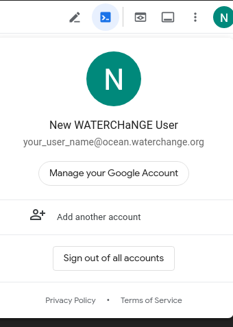
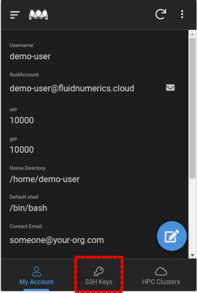

##################################
Managed Services User Onboarding
##################################

Fluid Numerics offers fully managed Research Computing Cluster (RCC) resources that are hosted on Google Cloud. You can access fully managed resources using either of the following mechanisms: 

1. `Become a member of OS Hackathon <https://www.oshackathon.org/resources/os-hpc-cluster/membership>`_
2. `Request fully managed services from Fluid Numerics <https://docs.google.com/forms/d/e/1FAIpQLSen0-aQ8OaD1sz26FlE_cbXmgO7R8GYWu-0IPSpPaLWPAGxJg/viewform>`_

If you are already part of an organization working with Fluid Numerics to provide fully managed services, this documentation will help you better understanding the onboarding process.

===============
Overview
===============
Since the RCC resources are hosted on Google Cloud, Fluid Numerics leverages `Cloud Identity <https://cloud.google.com/identity>`_ to manage user accounts and `OS Login <https://cloud.google.com/compute/docs/oslogin>`_ with `Identity and Access Management policies <https://cloud.google.com/iam>`_ to control access to your cluster. To gain access to an RCC that is provisioned for your organization, you will need to have a Cloud Identity account created by Fluid Numerics. Once the account is created, you will set your password and align an SSH key with your account. After these steps are completed, Fluid Numerics will notify you when you are able to access your cluster and will provide login instructions specific to your organization's managed cluster.

==================
Step-by-Step
==================

Request an account
======================

A managed RCC solution is associated with a Project Manager and a Billing Administrator at your organization. In most cases, requests for new accounts on a managed RCC solution are made through the designated Project Manager who will then request the account on your behalf. 

Set your password
=======================

Once the account has been requested, the Fluid Numerics support team will work with your Project Manager to provision a Cloud Identity account for you and associate it with POSIX account information such as username, user id, and group id. After your account is created and verified, you will receive an email from the Fluid Numerics support team confirming your account creation. This email indicates your username and the appropriate support email address that you can use to request support from Fluid Numerics.

Additionally, you will receive an email from Google Workspace requesting that you reset your account's password. The password reset link will expire after 48 hours. If your password reset link has expired, you will need to request support using the support email address provided in your first onboarding notification email.

Add an SSH Key
===================

Once you have set your password with your Cloud Identity account, you will need to `download the RCC User app for iOS or Android <https://www.appsheet.com/newshortcut/757bdf39-6c72-4826-ae69-f17e4bf18787>`_, or go to the `desktop version of the app <https://www.appsheet.com/start/757bdf39-6c72-4826-ae69-f17e4bf18787>`_. When logging in to the RCC User app, you will need to use the Cloud Identity account provided by Fluid Numerics, since this app is restricted to managed service users.

To make sure you are logged into the correct account, visit `shell.cloud.google.com <https://shell.cloud.google.com>`_ and click the circle in the top right corner:

Access to managed RCC resources is authenticated using SSH Keys. Before you can log in to the cluster, you will need to add at least one SSH key to your profile. You can use the RCC User app to keep track of your account information and to manage your SSH keys.

If you need to create an SSH key, follow the `instructions from Google Cloud <https://cloud.google.com/compute/docs/connect/create-ssh-keys>`_ to create a key pair that will be compatible with the RCC.

Once you have created an SSH key pair on your local workstation, you can add SSH Keys to your account :

1. In your browser, navigate to the Navigate to the `desktop version of the RCC User Management app <https://www.appsheet.com/start/757bdf39-6c72-4826-ae69-f17e4bf18787>`_ 
2. Navigate to the SSH Keys page.
3. Click the "+" symbol to add an ssh key.

Copy the contents of an `OpenSSH compliant public SSH Key <https://cloud.google.com/compute/docs/connect/create-ssh-keys>`_ into the "ssh key" field (Do not post your private key!) . Give the key a unique name in the "Key Name" field. Click "Save" when you are done.

Log in to the RCC
==================
Once your account has been fully credentialled, you will receive an email from Fluid Numerics support with instructions on how to log in to your cluster via ssh. From Linux and MacOS workstations, you will be able to ssh like you normally do for traditional on-premises research computing resources, e.g.

.. code-block:: shell

   ssh <username>@<cluster-name>.fluidnumerics.cloud

where :code:`<username>` is replaced with your assigned username on the cluster and :code:`<cluster-name>` is the assigned name of your cluster. At any time, you can find your account user name and cluster name at the `RCC User Management app <https://www.appsheet.com/start/757bdf39-6c72-4826-ae69-f17e4bf18787>`_ .

==================
Next Steps
==================
:doc:`Submit Batch Jobs <../HowTo/batch_jobs>`
:doc:`Submit Interactive Jobs <../HowTo/interactive_jobs>`
:doc:`Load Software with Spack <../HowTo/manage_spack_packages>`
