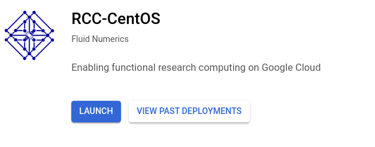
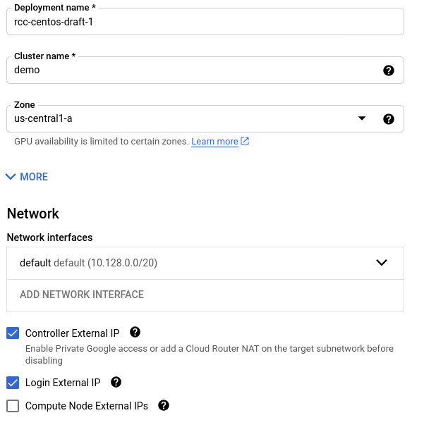
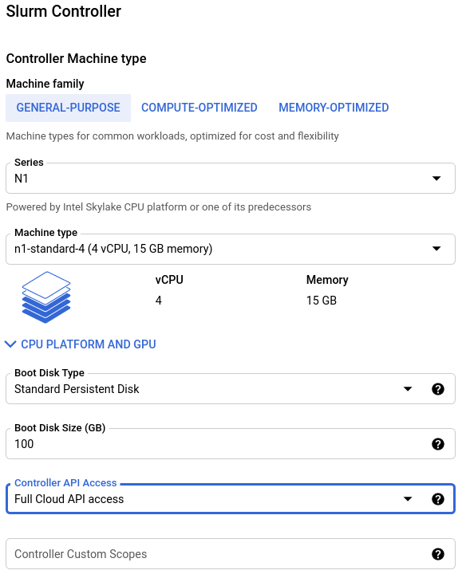
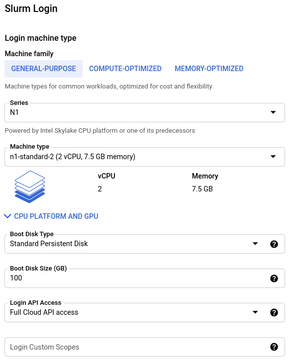
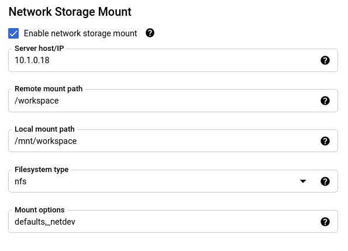
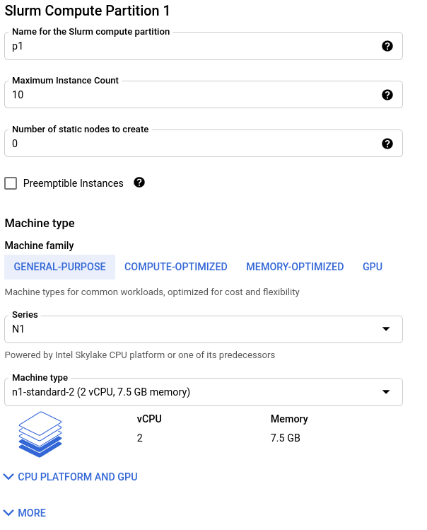

######################################
Deploy from Marketplace
######################################

The Research Computing Cluster (RCC) can be deployed from the Google Cloud Marketplace or by using :doc:`Terraform infrastructure-as-code <./deploy_with_terraform>`. Three different operating systems are available for the RCC and all are available on the Google Cloud Marketplace : 

* `CentOS 7 <https://console.cloud.google.com/marketplace/fluid-cluster-ops/rcc-centos>`_
* `Debian 10 <https://console.cloud.google.com/marketplace/fluid-cluster-ops/rcc-debian>`_
* `Ubuntu 20.04 <https://console.cloud.google.com/marketplace/fluid-cluster-ops/rcc-ubuntu>`_

All of the solutions have the same configurations available when deploying from the marketplace. This guide will walk you through configuring a RCC deployment through the Google Cloud Marketplace.

==============
Tutorial
==============

Getting Started
================

Set the cluster name and network
=================================

Configure the controller
=========================

Configure the login node
=========================

(Optional) Configure network storage
======================================

Configure the default compute partition
========================================

(Optional) Configure additional compute partitions
=====================================================
.. image:: ../img/marketplace_partition2.png
   :width: 800
   :alt: Configure the second partition

*****************************************
Next Steps
*****************************************
