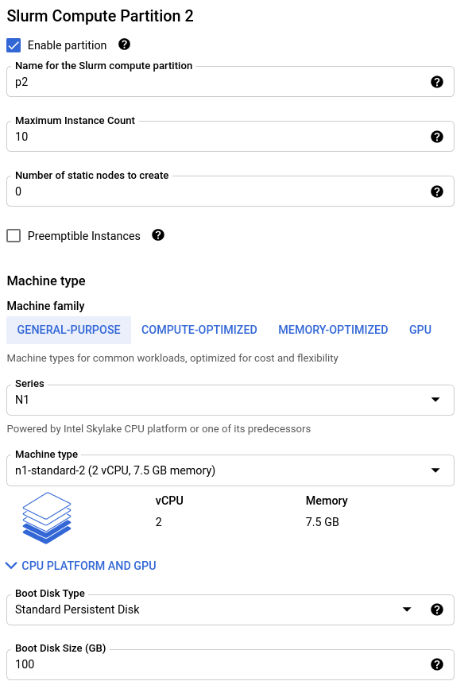

######################################
Deploy from Marketplace
######################################

The Research Computing Cluster (RCC) can be deployed from the Google Cloud Marketplace or by using :doc:`Terraform infrastructure-as-code <./deploy_with_terraform>`. Three different operating systems are available for the RCC and all are available on the Google Cloud Marketplace : 

* `CentOS 7 <https://console.cloud.google.com/marketplace/product/fluid-cluster-ops/rcc-centos>`_
* `Debian 10 <https://console.cloud.google.com/marketplace/product/fluid-cluster-ops/rcc-debian>`_
* `Ubuntu 20.04 <https://console.cloud.google.com/marketplace/product/fluid-cluster-ops/rcc-ubuntu>`_
* `CentOS 7 + WRF <https://console.cloud.google.com/marketplace/product/fluid-cluster-ops/rcc-wrf>`_

All of the solutions have the same configurations available when deploying from the marketplace. This guide will walk you through configuring a RCC deployment through the Google Cloud Marketplace.

==============
Tutorial
==============

Getting Started
================
First, decide which RCC solution you want to deploy (CentOS, Debian, or Ubuntu). This typically depends on operating system preference. 

Be aware of the following limitations :

* Ubuntu and Debian clusters do not have Lustre client installed. If you plan on using a Lustre file system, you will need to use the CentOS solution.
* The Debian cluster does not support ROCm, since AMD only support ROCm on Ubuntu and CentOS clusters.

.. image:: ../img/marketplace_launch.png
   :width: 800
   :alt: Launch the RCC marketplace solution

You can start by heading to one of the following marketplace pages for the RCC 

* `RCC-CentOS (CentOS 7) <https://console.cloud.google.com/marketplace/product/fluid-cluster-ops/rcc-centos>`_
* `RCC-Debian (Debian 10) <https://console.cloud.google.com/marketplace/product/fluid-cluster-ops/rcc-debian>`_
* `RCC-Ubuntu (Ubuntu 20.04) <https://console.cloud.google.com/marketplace/product/fluid-cluster-ops/rcc-ubuntu>`_
* `RCC-CentOS + WRF (CentOS 7 + WRF 4.2) <https://console.cloud.google.com/marketplace/product/fluid-cluster-ops/rcc-wrf>`_

Once at the Marketplace page, click "Launch"

Set the cluster name and network
=================================

.. image:: ../img/marketplace_name_and_network.png
   :width: 800
   :alt: Set the cluster name and configure the networking

Next, set the name of the deployment, the cluster name, the zone, and the network you will use to deploy the cluster.

The name of the deployment must be a unique deployment name within your Google Cloud project. This name will be referenced on the `Google Deployment Manager <https://cloud.google.com/deployment-manager/docs>`_ page where you will be able to keep track of all of the resources that are created.

The Cluster name is the name that will prefix all instances in your cluster. For example, if your Cluster name is set to :code:`demo`, your controller and login node will be :code:`demo-controller` and :code:`demo-login-1` respectively.

The Zone is the zone where you will deploy your controller and login node. The controller and login node will remain in this zone for the cluster's lifespan. This zone will also be the initial zone for your compute nodes. After deployment though, you can customize your compute partitions to deploy compute nodes to different regions and zones.

Next, choose an existing network to deploy your cluster under. The default network in your project is usually sufficient. It is recommended to check the boxes for "Controller External IP" and "Login External IP" so that you can ssh into these instances.

Configure the controller
=========================
.. image:: ../img/marketplace_controller.png
   :width: 800
   :alt: Configure the controller

Next, configure the controller instance for your cluster. The controller, by default, hosts the Slurm Controller daemon, Slurm Database Daemon, the Slurm database, and the :code:`/home` and :code:`/apps` NFS directories. 

For large jobs with parallel IO or high throughput computing workloads (with O(1000) simultaneous jobs), we recommend using :code:`n2-standard-32` instances for the controller, a boot disk size of 1 TB or greater, and SSD Persistent Disk.

Configure the login node
=========================
.. image:: ../img/marketplace_login.png
   :width: 800
   :alt: Configure the login node
Next, configure the login node for your cluster. The login node serves as the primary access point for users in your cluster and its size depends on the types of activities you will allow on the login node. 

Typically, only lightweight text editing and code compiling is permitted on this shared resource. For teams with less than 10 individuals, an :code:`n1-standard-16` is typically sufficient.

(Optional) Configure network storage
======================================
.. image:: ../img/marketplace_storage.png
   :width: 800
   :alt: Configure the network storage

If you have created a Filestore instance or a Lustre file system, you can attach it to your cluster. To use an existing network storage, 

* Check the box to "Enable network storage mount"
* Set the "Server host/IP" to the resolvable hostname or external IP address for your Filestore or Lustre MDS server.
* Set the "Remote mount path" to the path on the network storage server that is exported for mounting to other systems.
* Set the "Local mount path" to the path on your cluster where the file system should be mounted.
* Set the Filesystem type to "nfs" for Filestore instances or "lustre" for Lustre file systems.
* The default provided mount options are usually sufficient for getting started. If you have different preferences for mount options, you can set them in the "Mount options" field.

Configure the default compute partition
========================================

Your cluster organizes compute nodes into "partitions"; these are groupings of compute instances that have identical scheduling policies and, by default, identical machine configurations. To configure your first compute partition, 

* Set the "Name" for the compute partition. This is the name users will reference with Slurm's :code:`--partition` flag when submitting jobs.
* Set the "Maximum Instance Count" to the maximum number of compute nodes to host in this partition. When configuring your partitions, we highly recommend you `verify that you have sufficient quota <https://cloud.google.com/compute/quotas>`_ to support the partition.
* Set the "Number of static nodes to create" to the number of compute nodes in this partition that will remain live, even when jobs are not active.
* Next, configure the machine type information.

**For the RCC-WRF solution, ideal performance is achieved on compute optimized c2-standard-60 instances**

(Optional) Configure additional compute partitions
=====================================================

If you plan on having more than one compute node type in your cluster, you can configure up to three partitions from the marketplace panel. After deployment, you can use :code:`cluster-services` to :doc:`add more compute partitions <../HowTo/customize_compute_partitions>`_. Alternatively, if you'd like to work with more partitions, you can use the `RCC Terraform deployments <https://github.com/FluidNumerics/research-computing-cluster/tree/main/tf>`_.

*****************************************
Next Steps
*****************************************
